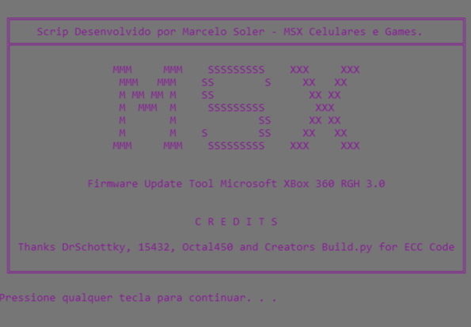

# RGH3.0 Script 

RGH3.0 é um simples arquivo de lote .BAT que facilita a utilização dos scripts desenvolvidos em python por DrSchottky/15432 - Todos direitos Reservados.

Carrega uma imagem com pontos de soldas nas respectivas placas e converte um backup da NAND e sua CPUKEY salvos na pasta NAND_DATA em NANDHACK3.0.

**Dependências**

Talvez você precise instalar o python em seu PC.

Testado em python 2.7 até o 3.10.

(Estes recursos são facilmente instalados com ajuda do PIP em seu prompt)

Crypto.Cipher.ARC4 => `pip install crypto`

## Novidades

Pontos de Solda
* Mostra os pontos de solda do PLL para cada modelo de placa.
* Importa a CPUKey do console se você fornecer um arquivo cpukey.txt dentro da pasta NAND_DATA tornando mais rápido e fácil a criação da NANDHACK3.

## Créditos

* DrSchottky (Desenvolvedor dos scritps em Python)
* 15432 (Pontos de PLL de todas as placas)
* Rubens Yama (Pela divulgação dos scripts)

## Changelog

### v0.1.1
* Imagens de Amostra dos pontos de soldagem
* Importação da CPUKEY do arquivo cpukey.txt

### v0.1
* Automação do prompt de comando
* Injeção autônoma dos arquivos de Xell na conversão
* Inclusão das Lib's para facilitar o funcionamento dos scripts em PC sem python